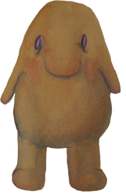
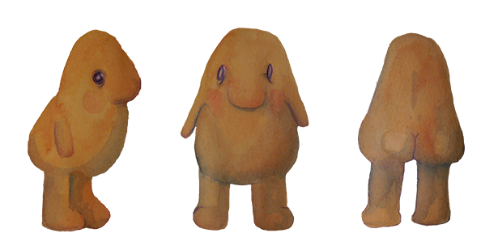
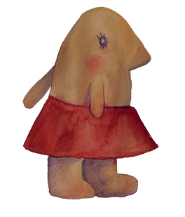
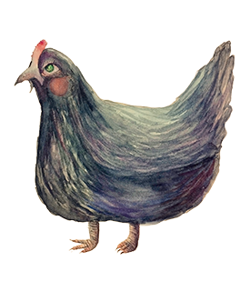
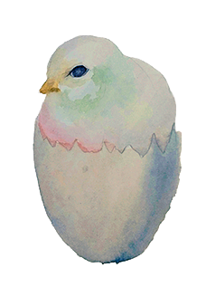
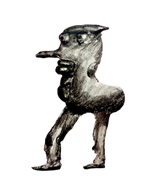

## (El bosquete)

Proyecto de Creación Multimedia Interactiva de la  Facultad de Bellas Artes de la Univesidad de Granada

# 1 Datos 

**Titulo** : El bosquete

**Web:**   [(url github.io)](https://elenanillo26.itch.io/el-bosquete)

**Autor:**  Elena Zorrilla Lara 

 [Profile Card](cmi-card.html)  [Alternate Profile Card](cmi-card2.html)

**Resumen** : Un niño se pierde en el bosque y tiene que encontrar a su mamá.
**Estilo/género:**  Point and click / juego / drama / fantasía... etc.

**Logotipo** : 

**Resolución:** 1152x648px tamaño fijo.

**Probado en:**  Google Chrome,móviles android, ordenador.

**Tamaño proyecto:** 158MB 

**Licencia** Este proyecto tiene una Licencia CC Reconocimiento Compartir igual (CC BY-SA)

**Fecha** : 27/05/2026

**Medios** :

- Github:
- Instagram
- Itch.io

# 2. Memoria del proyecto 

### 2.1 Storyboard: 
.
Una madre y su hijo van al bosque a por frutos, están andando pero el hijo se cae, la madre no se da cuenta y sigue de largo.

.
.

La madre desaparece entre los árboles del bosque y es secuestrada y despedazada por las criaturas que lo habitan. Su hijo debe embarcar una aventura para reecontrarse con su madre y volver a casa. Deberá explorar el bosque e interactuar con criaturas extrañas.

### 2.2. Esquema de navegación 

(imagen con las distintas pantallas de navegación, usa draw.io o cualquier programa de dibujo)

# 3. Metodología

Metodología de desarrollo de productos multimedia basado en una metodología de UX (User Experience)

## Etapa 1: Ideación de proyecto

**Investigación de campo** (propuestas inspiradoras para el proyecto)
Para hacer este proyecto me he basado en juegos de Point and Click como Samorost 3 o Machinarium del estudio Amanita Desing. Me he inspirado en las texturas y la mezcla de dibujo con fotografía para el apartado artístico.
También he tomado inspiración de cuentos populares y del papel que tiene el bosque en todos ellos.

**Motivación de la propuesta** 

Este  proyecto es interesante porque muestra una pequeña aventura en la que podemos acompañar a el pequeño nene para buscar a su madre. Según la decisión que tomemos podemos llevarle a la muerte o de vuelta con su madre, asi que el jugador tiene un papel importante. He intentado ser lo más experimental posible en la parte artística para que sea estético y gustoso de jugar.

**Publico / audiencia**

- Orientado a personas que le guste lo extraño, los cuentos populares, los Points and Click y las criaturas raras.

## Etapa 2: Desarrollo / actividades realizadas

(qué soluciones has planteado y cómo se han resuelto: juego, galería de fotos, grabación de video, etc.)

- Juego: Principálmente he empleado animaciones y botones que mediante señales van moviendo al personaje de un escenario a otro, u interactuando con los personajes. He hecho los fondos con una mezcla de fotografías propias y de internet editadas. Y los personajes los he diseñado y dibujado con acuarelas. Dando resultado a una pequeña historia, que usa un Point and clik simple pero bonito.

- Vídeo: consiste en una cinta VHS que compré en un videoclub con mi pareja de un bebé bailando, el video es antiguo y poco conocido, pero sentí que pegaba mucho con la estética del juego y decidí añadirlo en el puzzle, cuando el nene está buscando al pollito de la gallina, le añade un toque cómico y extraño.

- Instrucciones y ayuda al usuario: El juego consiste en un Point and Clik, debes ir pinchando en los caminos para que el personaje avance y también pinchar en los objetos con los que tienes que interactuar. Aparecen instrucciones arriba en la pantalla para guiar al jugador. Y cuando es menos obvio que se pueda interactuar con alguna cosa, el objeto/personaje brilla al pasar el ratón por encima.

- Menús y elementos de navegación: el menú está introducido con una pequeña animación de moscas volando, que luego se transforman en botones, cada mosca lleva a un sitio diferente (galería, inicio del juego, créditos). Todo el juego está conectado con botones y si en algún momento se quiere volver al menú principal, hay un botón de una mosca en la esquina superior.

## Etapa 3: Problemas identificados

En un principio quería hacer un proyecto mucho más largo, con más puzzles y que en cada puzzle el niño consiguiera un trozo de la madre y se le guardara en un menú hasta que llegara al último puzzle, obtuviera todos los trozos de la madre repartidos por el bosque y la pudiera reconstruir. Sin embargo por cuestiones de tiempo no he podido hacerlo tan extenso, por lo que he tenido que resolver el juego con un puzzle.
Por otro lado, puede que no sea muy obvio a veces donde tiene que pinchar el jugador, por eso he puesto textos y he hecho que los botones se ilumínen al pasar el ratón por encima para que se pueda entender mejor.
A pesar de que he puesto la música en bucle, deja de sonar en un punto y no he podido solucionarlo.

# 4. Conclusiones 

En un futuro me gustaría hacer los demás puzzles que tenía en mente, tenía la idea de 5 puzzles, uno por cada parte de la madre. También me gustaría hacer el mapa del bosque más amplio para que el jugador pueda explorar y perderse por el mundo. 
Estoy orgullosa de la parte estética, pero si amplío el juego con los demás puzzles quedará todo con más sentido. Aun así, creo que se entiende toda la historia del juego.
Tamnién, me gustaría modificar la banda sonora que he compuesto para añadirle quizás más sonidos y que quede más inversivo el juego.

# 5 Referencias 

-Samorost 3. Amanita Desing. 2016
-Machinarium. Amanita Desing. 2009
-Botanicula. Amanita Desing. 2012
-Inspiración en cuentos como Hänsel y Gretel, La vieja del bosque, La casa del bosque, Los doce hermanos, etc. De los Hermanos Grimm.

**Recursos y materiales audiovisuales:**

* Musica: Compuesta con el FL Studio. (Le he añadido grabaciones de sonidos ambientales).  
* Imágenes: Fotografías propias, fotografías de internet y dibujos propios.  
* Tipografía: Bosque encantado, de Juan Casco. En la página DaFont. 

**Herramientas utilizadas**

- Godot Engine 4.x
- Photoshop
- -FL Studio

(imagen de la licencia, copiar y pegar aquí la correcta)
https://creativecommons.org/licenses/?lang=es

* logos en https://creativecommons.org/mission/downloads/
  
  </small>

Mayo 2026
